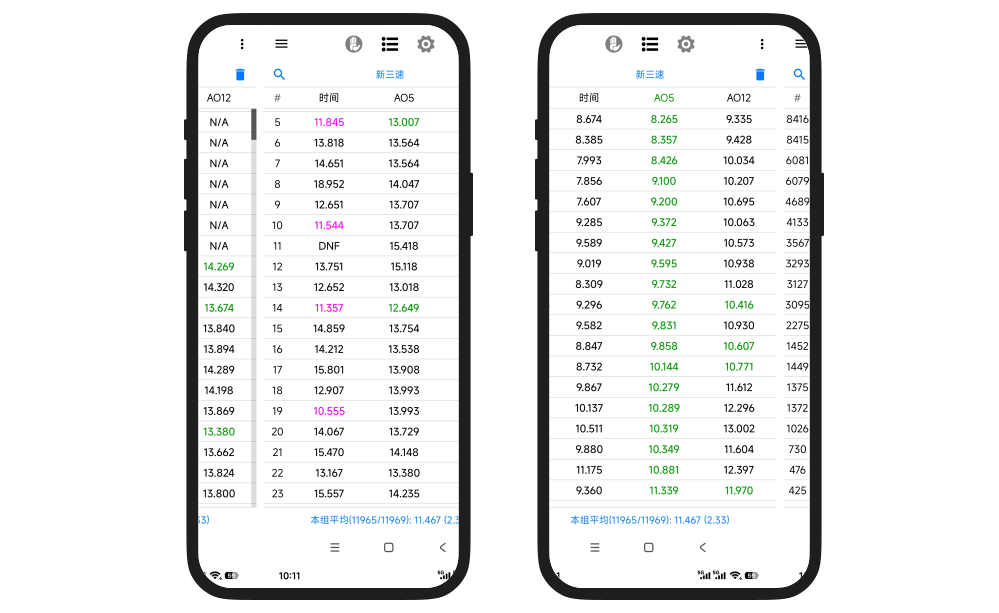

<h4 align="right">English | <strong><a href="README.md">简体中文</a></strong></h4>

  

  <h1>DCTimer-BLE-GYRO</h1>

  

    A speedcubing timer based on DCTimer-BLE, with MoYu AI / MoYu32 gyroscope orientation tracking and one-tap orientation calibration.
  

  

    
    
    
  

  

    
    
  

---

## About

`DCTimer-BLE-GYRO` is a modified version of [DCTimer-BLE](https://github.com/huizhiLLL/DCTimer-BLE). The upstream project already provides speedcubing timing, smart cube connection, Bluetooth timer support, scramble generation, solve history, statistics, and real-time smart cube 3D previews.

This fork focuses on adding gyroscope/orientation support for `MoYu AI / MoYu32` smart cubes. The cube state dialog can now render the 3D cube according to the physical cube orientation and supports one-tap calibration to a white-top, green-front reference view.

## Download

- [GitHub Releases](https://github.com/HrrToT/DCTimer-BLE-GYRO/releases/latest)

> DCTimer-BLE-GYRO uses a different package name from the original DCTimer, so it will not conflict during installation.
> The data format remains compatible with the upstream project. You can export data from the original DCTimer/DCTimer-BLE and import it into this version.

## New Features

- Reads `171` orientation packets from `MoYu AI / MoYu32` smart cubes.
- Converts MoYu orientation packets into quaternions and feeds them into the real-time 3D cube preview.
- Maps the MoYu AI coordinate system into the app's OpenGL coordinate system so whole-cube `x / y / z` rotations match the on-screen direction.
- Adds `Reset orientation` in the smart cube state dialog to calibrate the current physical pose as the white-top, green-front display reference.
- Adjusts the default 3D camera so the calibrated view mainly shows the white top face and green front face.

## Upstream Features

- Standard speedcubing timer, WCA inspection timing, solve history, and statistics.
- Scramble generation, scramble import/export, and database import/export.
- Smart cube auto start/stop, scramble progress hints, and deviation correction.
- Real-time 3D smart cube state preview.
- QiYi Smart Timer Bluetooth timer support.
- 8s/12s voice reminders for WCA inspection mode.
- PB history markers and solve-list sorting.

## Supported Devices

The upstream project supports:

- `Moyu32` / `MoYu AI` smart cubes
- `QYSC` / `Tornado V4` QiYi smart cubes and Tornado series
- `GAN v2 / v3 / v4` smart cubes
- `QiYi Smart Timer`

This fork currently adds orientation tracking for:

- `MoYu AI / MoYu32`

Other brands do not yet have orientation tracking enabled, but the shared `SmartCubeOrientation` model and callback pipeline are in place for future protocol-specific integration.

## Usage

1. Open the project in Android Studio and run it on a physical Android device.
2. Select the smart cube timing mode in the app.
3. Scan for and connect a `MoYu AI / MoYu32` smart cube.
4. Open the smart cube state dialog.
5. Place the physical cube in a white-top, green-front horizontal pose.
6. Tap `Reset orientation` to use the current pose as the display reference.
7. Whole-cube rotations should then be reflected by the 3D cube preview.

## Development Environment

- AndroidX
- Android Gradle Plugin 8.9.2
- Gradle 8.11.1
- JDK 17
- `compileSdk / targetSdk` 35
- Native Android Java project

## Main Changed Files

- `app/src/main/java/com/dctimer/model/SmartCubeOrientation.java`
- `app/src/main/java/com/dctimer/model/SmartCube.java`
- `app/src/main/java/com/dctimer/util/BluetoothTools.java`
- `app/src/main/java/com/dctimer/util/Moyu32CubeProtocol.java`
- `app/src/main/java/com/dctimer/view/SmartCube3DView.java`
- `app/src/main/java/com/dctimer/dialog/CubeStateDialog.java`
- `app/src/main/res/layout/dialog_cube_state.xml`

## Acknowledgements

- [DCTimer-Android](https://github.com/MeigenChou/DCTimer-Android): original DCTimer-Android project
- [DCTimer-BLE](https://github.com/huizhiLLL/DCTimer-BLE): direct upstream project for this fork
- [cstimer](https://github.com/cs0x7f/cstimer): smart cube protocol reference
- [smartcube-web-bluetooth](https://github.com/poliva/smartcube-web-bluetooth): smart cube protocol reference
- [qiyi_smartcube_protocol](https://codeberg.org/Flying-Toast/qiyi_smartcube_protocol): smart cube protocol reference
- [CubicTimer](https://github.com/hato-ya/CubicTimer): QiYi Smart Timer integration reference

## License

This project follows the upstream GPLv3 license. Original copyright and attribution should be preserved. The MoYu AI orientation-tracking additions are maintained in this repository.
