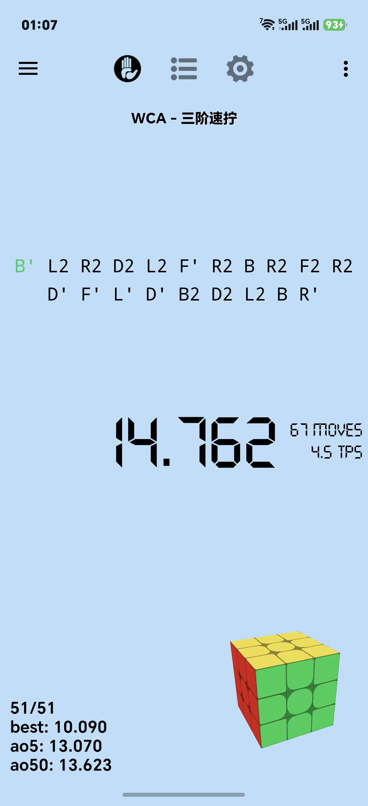
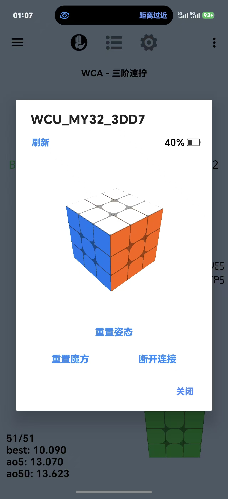
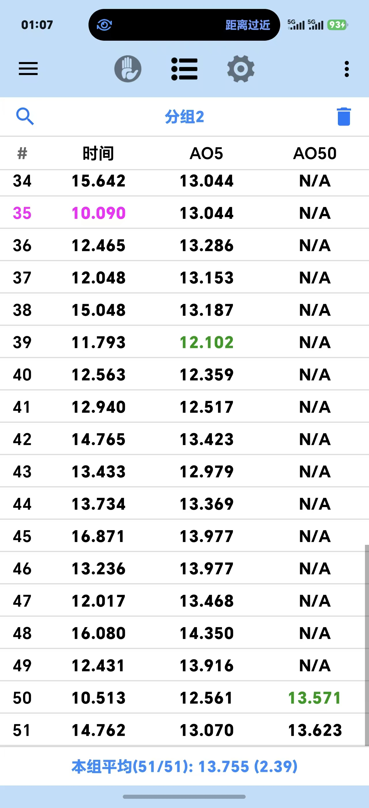

<h4 align="right"><strong><a href="README-en.md">English</a></strong> | 简体中文</h4>

  

  <h1>DCTimerAI</h1>

  

    基于 DCTimer-BLE 二次开发的魔方计时器，增加 MoYu AI / MoYu32 智能魔方姿态跟随与一键姿态校准能力。
  

  

    
    
    
  

  

    
    
    
  

---

## 项目说明

`DCTimerAI` 是基于 [DCTimer-BLE](https://github.com/huizhiLLL/DCTimer-BLE) 的二次开发版本。原项目已经支持普通魔方计时、智能魔方连接、蓝牙计时器、打乱生成、成绩保存、统计和智能魔方 3D 状态预览。

本分支在原功能基础上，重点增加了 `MoYu AI / MoYu32` 智能魔方的陀螺仪/姿态数据读取能力，让状态弹窗中的 3D 魔方可以跟随实物整体转动，并支持一键重置到校准视角。

## 下载与安装

- [GitHub Releases](https://github.com/HrrToT/DCTimerAI/releases/latest)

> DCTimerAI 与原 DCTimer 使用不同包名，不会与原版 DCTimer 发生安装冲突。
> 数据格式兼容原项目，可通过导出/导入数据库迁移历史成绩。

## 新增
### 能力
- 支持读取 `MoYu AI / MoYu32` 智能魔方 `171` 姿态数据包。将 MoYu 姿态包解析为四元数，并接入实时 3D 魔方预览。
- 在智能魔方状态弹窗中新增 `重置姿态`，调整 3D 魔方默认相机视角，使重置姿态后主要显示白色顶面和绿色正面，便于校准。主界面支持双击魔方快速重置视角.

### 外观
- 将原先偏贴纸式的预览重构为 `cubie` 级立体渲染，每个小块都具有完整的正面和侧面。改为更接近现代实色魔方的视觉风格：白色塑料感主体、彩色实色面、同色深边过渡，按块型区分圆角。

## 原有功能

- 普通魔方计时、观察计时、成绩保存和统计。
- 打乱生成、打乱导入/导出、数据库导入/导出。
- 智能魔方自动起停表、打乱进度提示、偏离纠错。
- 智能魔方实时 3D 状态预览。
- QiYi Smart Timer 蓝牙计时器支持。
- WCA 观察模式 8 秒/12 秒语音提醒。
- PB 历史标记和成绩排序。

## 支持设备

原项目已支持：

- `Moyu32` / `MoYu AI` 智能魔方
- `QYSC` / `Tornado V4` 奇艺智能魔方和 Tornado 系列
- `GAN v2 / v3 / v4` 智能魔方
- `QiYi Smart Timer` 奇艺智能计时器

本分支当前新增的姿态跟随能力优先面向：

- `MoYu AI / MoYu32`

其他品牌的姿态跟随暂未接入，但代码中已经保留了统一的 `SmartCubeOrientation` 数据模型和回调管线，后续可按协议继续扩展。

## 使用说明

1. 在 Android Studio 中打开项目并运行到安卓真机。
2. 在 App 中选择智能魔方计时模式。
3. 扫描并连接 `MoYu AI / MoYu32` 智能魔方。
4. 打开智能魔方状态弹窗。
5. 将实物魔方摆成白顶绿前水平放置。
6. 点击 `重置姿态`，将当前姿态设为显示基准。
7. 之后整体转动魔方时，弹窗中的 3D 魔方会跟随姿态变化。

## 开发环境

- AndroidX
- Android Gradle Plugin 8.9.2
- Gradle 8.11.1
- JDK 17
- `compileSdk / targetSdk` 35
- Java 原生 Android 项目

## 主要改动文件

- `app/src/main/java/com/dctimer/model/SmartCubeOrientation.java`
- `app/src/main/java/com/dctimer/model/SmartCube.java`
- `app/src/main/java/com/dctimer/util/BluetoothTools.java`
- `app/src/main/java/com/dctimer/util/Moyu32CubeProtocol.java`
- `app/src/main/java/com/dctimer/view/SmartCube3DView.java`
- `app/src/main/java/com/dctimer/view/SmartCubeImageView.java`
- `app/src/main/java/com/dctimer/util/Utils.java`
- `app/src/main/java/com/dctimer/dialog/CubeStateDialog.java`
- `app/src/main/res/layout/dialog_cube_state.xml`

## 当前维护

- 当前维护与定制：胡图图
- 技术协作：Codex
- 当前仓库地址：[HrrToT/DCTimerAI](https://github.com/HrrToT/DCTimerAI)

## 致谢

- [DCTimer-Android](https://github.com/MeigenChou/DCTimer-Android)：原始 DCTimer-Android 项目
- [DCTimer-BLE](https://github.com/huizhiLLL/DCTimer-BLE)：本项目的直接基础版本
- [cstimer](https://github.com/cs0x7f/cstimer)：智能魔方协议参考
- [smartcube-web-bluetooth](https://github.com/poliva/smartcube-web-bluetooth)：智能魔方协议参考
- [qiyi_smartcube_protocol](https://codeberg.org/Flying-Toast/qiyi_smartcube_protocol)：智能魔方协议参考
- [CubicTimer](https://github.com/hato-ya/CubicTimer)：QiYi Smart Timer 接入参考

## License

本项目沿用原项目的 GPLv3 协议。原项目版权和署名应继续保留，本分支新增的 MoYu AI 姿态跟随相关代码由当前仓库维护。
